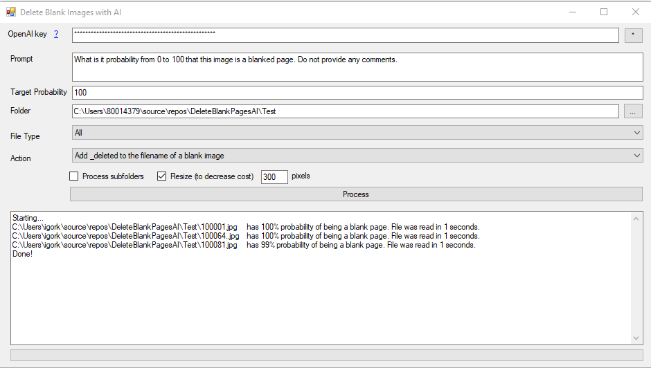

# Delete Blank Scanned Image File with AI

This application will tell you if a scanned image file is blank

Introduction This application will tell you if a scanned image file (JPG, GIF, PNG or TIF) is blank.

One you detected a blank file, you can:

1. Add _deleted to the filename of a blank image
3. Place blank images to to_be_deleted folder
3. Delete blank images

   
